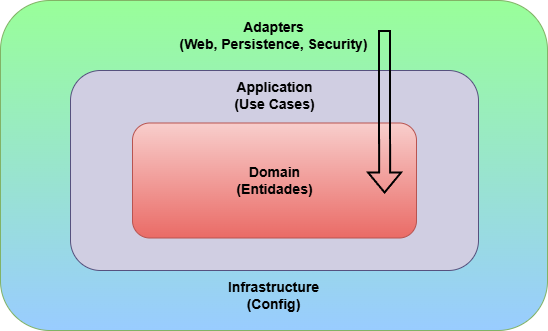
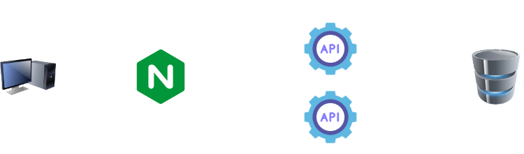

# Gestor de Reservas de Recursos (GestRec)

## 1. Descrição do Problema
Em diversos contextos organizacionais existe a necessidade de gerenciar a reserva de recursos compartilhados, como salas de reunião, equipamentos ou outros ativos.  
Quando esse controle é feito de forma manual ou descentralizada, surgem problemas como conflitos de horário, falta de rastreabilidade e dificuldade de manutenção das informações.

O sistema **Gestor de Recursos (GestRec)** foi proposto para resolver esse problema de forma simples e organizada, centralizando o controle de recursos e suas respectivas reservas.

---

## 2. Objetivo do Sistema
O objetivo do sistema é permitir o **cadastro, consulta e reserva de recursos**, garantindo que as regras de negócio sejam respeitadas, como evitar conflitos de horário e impedir a reserva de recursos inativos.

---

## 3. Estilo Arquitetural Adotado
O sistema foi desenvolvido utilizando o estilo arquitetural **Monolítico**, organizado internamente segundo os princípios da **Clean Architecture** e inspirando-se em **Ports & Adapters (Hexagonal Architecture)**.

### Justificativa
- O escopo do projeto é pequeno e bem definido.
- Um monólito reduz a complexidade de infraestrutura e facilita a entrega.
- A Clean Architecture permite separar claramente regras de negócio de detalhes técnicos, mesmo em um sistema simples.
- A adoção de ports & adapters garante baixo acoplamento e facilita evolução futura (ex.: migração para microserviços).

---

## 4. Arquitetura do Sistema
A arquitetura segue os princípios da **Clean Architecture**, organizando o sistema em camadas com dependências direcionadas para o núcleo do domínio.

### Camadas
- **Domain**: contém o modelo de domínio e as regras de negócio invariantes, que sempre devem ser respeitadas, independentemente do fluxo de aplicação ou da interface utilizada.
- **Application (Use Cases)**: orquestra os casos de uso do sistema, coordenando entidades do domínio e aplicando regras de negócio dependentes de contexto, que envolvem múltiplas entidades, acesso a repositórios e políticas de aplicação.
- **Adapters**: fazem a adaptação entre o mundo externo (HTTP, banco de dados, segurança) e o domínio.
- **Infrastructure**: concentra configurações técnicas e integração com frameworks.

### Diagrama Simplificado



### Arquitetura de Infraestrutura

O sistema utiliza **Nginx como Reverse Proxy** para adicionar uma camada de segurança, performance e gerenciamento de requisições:



**Benefícios do Nginx:**
- Reverse proxy e load balancing
- Headers de segurança
- Rate limiting (proteção contra DDoS)
- Compressão GZIP
- Cache de respostas
- Páginas de erro customizadas
- Autenticação básica para documentação

---

## 5. Decisões Arquiteturais

### Clean Architecture
- Separação clara de responsabilidades
- Baixo acoplamento entre camadas
- Independência das regras de negócio em relação a frameworks

### Conceitos inspirados em DDD
- Modelagem explícita do domínio
- Entidades representando conceitos do mundo real (Recurso, Reserva, TipoRecurso, Usuário)
- Regras de negócio centralizadas no domínio

### SOLID
- Classes com responsabilidades bem definidas
- Dependência de abstrações
- Facilidade de manutenção e evolução

### Alternativas Consideradas
- **Microserviços**: descartado devido ao escopo reduzido e à complexidade desnecessária.
- **Arquitetura em camadas tradicional**: considerada, mas a Clean Architecture oferece melhor controle de dependências.

### Impactos das Decisões
- **Monólito**: simplicidade de deploy e menor custo de infraestrutura.
- **Ports & Adapters**: flexibilidade para evoluir o sistema sem alterar o núcleo de negócio.
- **Clean Architecture**: facilita testes unitários e manutenção.

---

## 6. Tecnologias Utilizadas

**Backend:**
- Java 21 / Spring Boot 4
- Spring Data JPA, Spring Security
- JWT (JSON Web Token)
- Swagger / OpenAPI
- Flyway (migrations)
- Lombok, MapStruct

**Infraestrutura:**
- Nginx 1.29 (reverse proxy)
- PostgreSQL 18.1
- Docker & Docker Compose
- Maven (build)

---

## 7. Funcionalidades Principais
1. Cadastro de tipos de recursos
2. Cadastro de recursos
3. Criação de reservas
4. Cancelamento de reservas
5. Consulta de reservas com filtros combináveis (recurso, período, usuário, status)
6. Autenticação de usuários via JWT
7. Autorização baseada em perfil de usuário
8. Proteção de endpoints sensíveis

### Regras de Negócio
- Não permitir reservas com conflito de horário para o mesmo recurso
- Recursos inativos não podem ser reservados
- A data de início da reserva deve ser anterior à data de fim
- Não permitir a criação de reservas com data/hora no passado
- Apenas usuários autenticados podem realizar reservas
- Determinadas operações são restritas a perfis específicos

---

## 8. Segurança
A aplicação utiliza autenticação baseada em JWT (JSON Web Token).

- O login gera um token de acesso
- O token deve ser enviado no header `Authorization`
- O controle de acesso é realizado com base no perfil do usuário
- Usuários comuns podem manipular apenas suas próprias reservas, enquanto administradores possuem acesso ampliado
- A segurança é integrada ao Spring Security

---

## 9. Como Executar

### Pré-requisitos
- Docker e Docker Compose instalados
- Git

### Passo a Passo

1. **Clonar o repositório**
```bash
git clone https://github.com/gabrielsmm/gestrec-api.git
cd gestrec-api
```

2. **Criar arquivo `.env` na raiz do projeto**
```env
DATABASE_USERNAME=seu_usuario
DATABASE_PASSWORD=sua_senha
```

3. **Subir os containers**
```bash
# Subir com 1 instância da API
docker compose up -d

# OU subir com 3 instâncias (para testar balanceamento)
docker compose up -d --scale api=3
```

4. **Verificar se os containers estão rodando**
```bash
docker compose ps
```

5. **Acessar a aplicação**
- API: http://localhost/api
- Swagger UI: http://localhost/swagger-ui/index.html (usuário: `admin` / senha: `admin123`)
- Health Check: http://localhost/health

6. **Ver logs**
```bash
# Logs do Nginx
docker logs -f gestrec-nginx

# Logs da API
docker compose logs -f api
```

7. **Parar os containers**
```bash
docker compose down
```

---

## 10. Como Testar os Requisitos

### ✅ Reverse Proxy

**Teste:** Verificar que a API só é acessível via porta 80 do Nginx

```bash
# ✅ Deve funcionar (via Nginx)
curl http://localhost/api/recursos

# ❌ Porta 8080 não está exposta externamente
curl http://localhost:8080/api/recursos
# Resultado: Connection refused (esperado)
```

---

### ✅ Headers de Segurança

**Teste:** Verificar headers de segurança nas respostas

```bash
# PowerShell
curl -Method GET -Uri "http://localhost/api/recursos" -Verbose

# Ou visualizar no navegador (F12 > Network > Headers)
```

**Evidência esperada:**
```
X-Content-Type-Options: nosniff
X-Frame-Options: DENY
X-XSS-Protection: 1; mode=block
```

---

### ✅ Rate Limiting

**Teste:** Disparar mais de 15 requisições rapidamente (limite: 5/s + burst 10)

```powershell
# PowerShell - dispara 20 requisições
for ($i=1; $i -le 20; $i++) { 
    curl http://localhost/api/recursos
}
```

**Evidência esperada:**
- Primeiras 15 requisições: **HTTP 200**
- Requisições seguintes: **HTTP 429 Too Many Requests**

---

### ✅ Limite de Payload

**Teste:** Enviar payload maior que 1MB

```powershell
# Criar arquivo de 2MB
$content = "x" * 2MB
$content | Out-File -FilePath test.json

# Tentar enviar
curl -Method POST -Uri "http://localhost/api/recursos" `
     -ContentType "application/json" `
     -InFile test.json
```

**Evidência esperada:**
- **HTTP 413 Request Entity Too Large**

---

### ✅ Compressão

**Teste:** Verificar header `Content-Encoding: gzip`

```powershell
# PowerShell
curl -Method GET -Uri "http://localhost/api/recursos" `
     -Headers @{"Accept-Encoding"="gzip"} -Verbose
```

**Evidência esperada:**
```
Content-Encoding: gzip
```

---

### ✅ Log Estruturado

**Teste:** Visualizar logs do Nginx com campos customizados

```bash
# Acompanhar logs em tempo real
docker exec gestrec-nginx tail -f /var/log/nginx/access.log

# Fazer algumas requisições
curl http://localhost/api/recursos
```

**Evidência esperada:**
```
172.18.0.1 | GET /api/recursos | 200 | upstream=172.18.0.4:8080 | upstream_time=0.042s | total_time=0.043s
```

Campos presentes:
- IP do cliente (`172.18.0.1`)
- Método HTTP (`GET`)
- Status (`200`)
- Tempo de resposta do upstream (`0.042s`)

---

### ✅ Cache de GET

**Teste:** Fazer requisições GET repetidas

```bash
# Primeira requisição (sem cache)
curl http://localhost/api/recursos -v | Select-String "X-Cache-Status"

# Segunda requisição em <10s (com cache)
curl http://localhost/api/recursos -v | Select-String "X-Cache-Status"
```

**Evidência esperada:**
```
X-Cache-Status: MISS  # Primeira requisição
X-Cache-Status: HIT   # Segunda requisição (dentro de 10s)
```

---

### ✅ Basic Auth no Swagger

**Teste:** Acessar Swagger UI

```
1. Abrir: http://localhost/swagger-ui/index.html
2. Deve solicitar autenticação
3. Usuário: admin
4. Senha: admin123
```

**Evidência:** Popup de autenticação básica aparece antes de acessar o Swagger.

---

### ✅ Custom Error Pages

**Teste 1:** Página 404 customizada
```bash
curl http://localhost/pagina-inexistente
```

**Teste 2:** Página 50x customizada
```bash
# Derrubar a API temporariamente
docker compose stop api

# Tentar acessar
curl http://localhost/api/recursos

# Religar a API
docker compose start api
```

**Evidência:** Páginas HTML customizadas e estilizadas são exibidas.

---

### ✅ Balanceamento de Carga

**Teste:** Subir múltiplas instâncias e verificar distribuição

```bash
# Subir 3 instâncias
docker compose up -d --scale api=3

# Fazer várias requisições
for ($i=1; $i -le 10; $i++) { 
    curl http://localhost/api/recursos
    Start-Sleep -Milliseconds 500
}

# Ver logs do Nginx
docker exec gestrec-nginx tail -20 /var/log/nginx/access.log
```

**Evidência esperada:** O campo `upstream=` nos logs alterna entre diferentes IPs:
```
upstream=172.18.0.5:8080
upstream=172.18.0.6:8080
upstream=172.18.0.7:8080
```

---

## 11. Integrantes

- Gabriel da Silva Mendes de Moraes